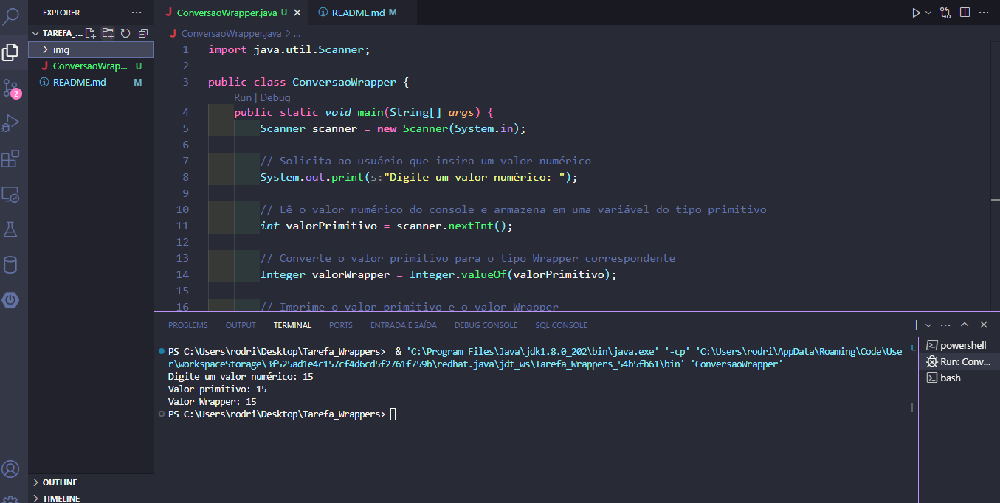

<!DOCTYPE html>
<html lang="pt-br">
<head>
    <meta charset="UTF-8">
    <meta name="viewport" content="width=device-width, initial-scale=1.0">
    <meta name="description" content="Descrição do projeto Java de Conversão de Tipos Primitivos para Wrappers">
    <meta name="keywords" content="Java, Conversão de Tipos, Wrapper, Projeto">
    <meta name="author" content="Ana Alice Rodrigues">

</head>
<body>

<header>
    <h1>Projeto Java - Conversão de Tipos</h1>
    
</header>

    
Índice

    <ol>
        <li><a href="#sobre-o-projeto">Sobre o projeto</a></li>
        <li><a href="#parte-tecnica">Parte Técnica</a></li>
        <li><a href="#estrutura-dos-arquivos">Estrutura dos Arquivos</a></li>
        <li><a href="#casos-de-uso">Casos de Uso</a></li>
        <li><a href="#ferramentas">Ferramentas</a></li>
        <li><a href="#contato">Contato</a></li>
    </ol>

<section id="sobre-o-projeto">
    <h2>Sobre o projeto</h2>
    

        Este é um projeto Java que demonstra como converter um tipo primitivo para seu respectivo tipo wrapper.
    

    

        Proposta de Valor: Oferecer uma experiência de aprendizado prático sobre conversão de tipos em Java.
    

</section>

<section id="parte-tecnica">
    <h2>Parte Técnica</h2>
    <ul>
        <li>Linguagem: Java</li>
        <li>Ferramentas Utilizadas: VSCode</li>
    </ul>
</section>

<section id="estrutura-dos-arquivos">
    <h2>Estrutura dos Arquivos</h2>
    <ul>
        <li>ConversaoWrapper.java</li>
    </ul>
</section>

<section id="casos-de-uso">
    <h2>Casos de Uso</h2>
    <ul>
        <li>Executar o programa</li>
        <li>Inserir um valor numérico</li>
        <li>Observar a conversão para tipo wrapper</li>
    </ul>
</section>

<section id="ferramentas">
    <h2>Ferramentas</h2>
    <ul>
        <li></li>
        <li></li>
    </ul>
</section>

<section id="contato">
    <h2>Contato</h2>
    <ul>
        <li></li>
    </ul>

</section>

</body>
</html>

